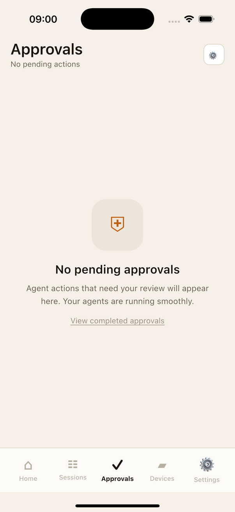

# App State Capture

**Timestamp:** 2026-05-31T09:00:07.158595

## Device
- Name: iPhone 16 Pro
- UDID: 51992D3D-F500-43CB-A594-6B85AF7B1E21
- State: Booted

## Screenshot

## Accessibility
- Elements: 13

## Files
- `screenshot.png` - Current screen
- `accessibility-tree.json` - Full UI hierarchy
- `device-info.json` - Device details
- `summary.json` - Complete capture metadata
